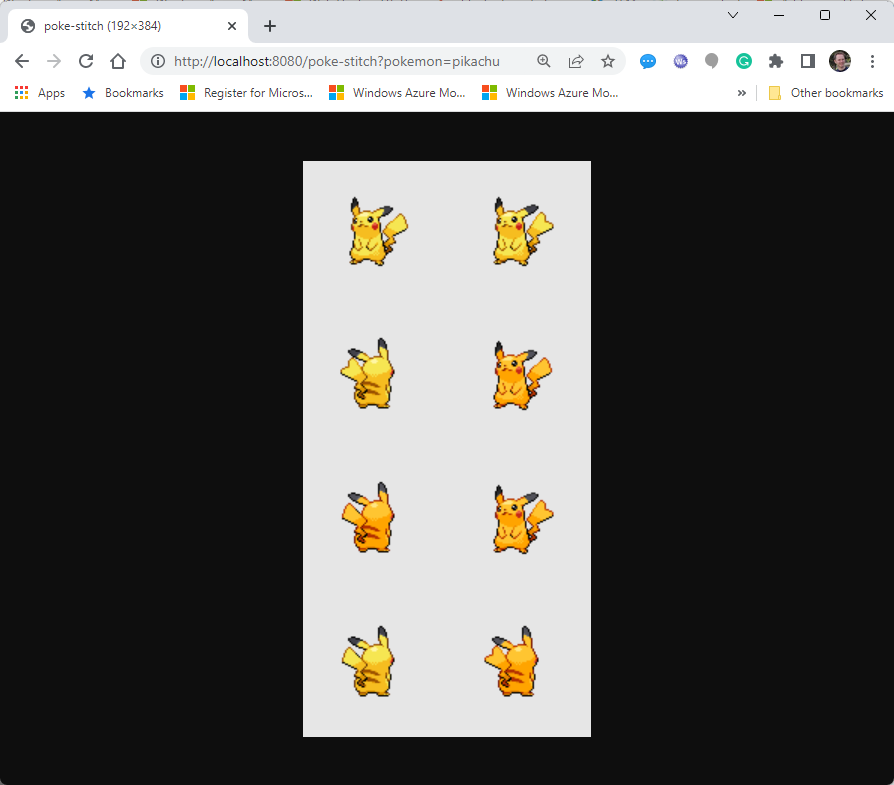

# Poke Stitch

## Exercise For Go Trainings

The [PokeApi](https://pokeapi.co/) offers a web API through which you can retrieve data about Pokemons. In this exercise, you build a webserver that queries the *PokeApi* in the background and creates a stitched (=combined) image of Pokemon sprites.



## Requirements

Functional requirements:

* Implement a webserver with Go
* The webserver must offer one route (e.g. *http://localhost:8080/poke-stitch?pokemon=bulbasaur* where *bulbasaur* is the name of a Pokemon)
  * The webserver has to return `http.StatusBadRequest` (`w.WriteHeader(http.StatusBadRequest)`) if the pokemon name is missing in the query string
  * In case of any other error, return `http.StatusInternalServerError`. Returning additional error details is not required in this sample.
* The route has to query the *PokeApi* (e.g. *https://pokeapi.co/api/v2/pokemon/bulbasaur*) to retrieve the Pokemon sprites (up to 8 images stored in JSON property *sprites*).
* All available sprites have to be stitched together (=combined) into a single image in which two sprites are displayed side by side.
* The webserver has to return the generated, combined image to the web client.

Non-functional requirements:

* After building a working prototype, try to get the sprite images in parallel using Goroutines.

## Tips

### Webserver

* You can use the sample [*03-simple-web-server](https://github.com/rstropek/golang-samples/blob/master/go-microservices/03-simple-web-server/web.go) as a starting point.
* Optionally, you can add graceful shutdown as shown in [04-advanced-web-server](https://github.com/rstropek/golang-samples/blob/master/go-microservices/04-advanced-web-server/web.go)

### Sending Web Requests

* You can send web requests to the *PokeApi* with Go's `http.Get` helper method. [The documentation](https://pkg.go.dev/net/http#example-Get) contains an example.
* To reduce the amount of code you need to write yourself, here is the data structure that can receive the Pokemon sprite from the *PokeApi*:

    ```go
    type pokemon struct {
        Sprites pokemonSprites `json:"sprites"`
    }
    
    type pokemonSprites struct {
        BackDefault      string `json:"back_default"`
        BackFemale       string `json:"back_female"`
        BackShiny        string `json:"back_shiny"`
        BackShinyFemale  string `json:"back_shiny_female"`
        FrontDefault     string `json:"front_default"`
        FrontFemale      string `json:"front_female"`
        FrontShiny       string `json:"front_shiny"`
        FrontShinyFemale string `json:"front_shiny_female"`
    }
    ```

### Images

* Go has 2D image functionality built in ([`image` package](https://pkg.go.dev/image))
* To make combining the images easier, consider the package [*go-image-merge*](https://github.com/ozankasikci/go-image-merge). It is a lightweight package making combining images relatively simple. **Note:** In order to get the latest 0.2.3 preview version, run *go get github.com/ozankasikci/go-image-merge@66fdff08137800ab01d23717d10b2a0b663efe17* (where *66fd...* is the latest git commit in the repository at the time of writing this guide). Here is a code sample for how to combine four images with *go-image-merge*:

    ```go
    import (
        ...
        gim "github.com/ozankasikci/go-image-merge"
    )
    ...
    
    // `images` contains a slide or channel of `image.Image` objects
    
    // Build a data structure containing all source images
    grids := make([]*gim.Grid, 0)
    for img := range images {
        grids = append(grids, &gim.Grid{Image: img})
    }
    
    // Combine the images
    rgba, err := gim.New(grids, 2 /* columns */, 2 /* rows; you have to calculate this value */).Merge()
    ...
    
    // Encode the combined image into a PNG image
    b := new(bytes.Buffer)
    wr := bufio.NewWriter(b)
    err = png.Encode(wr, rgba)
    wr.Flush()
    
    // b now contains the bytes of the combined PNG image
    ...
    ```
